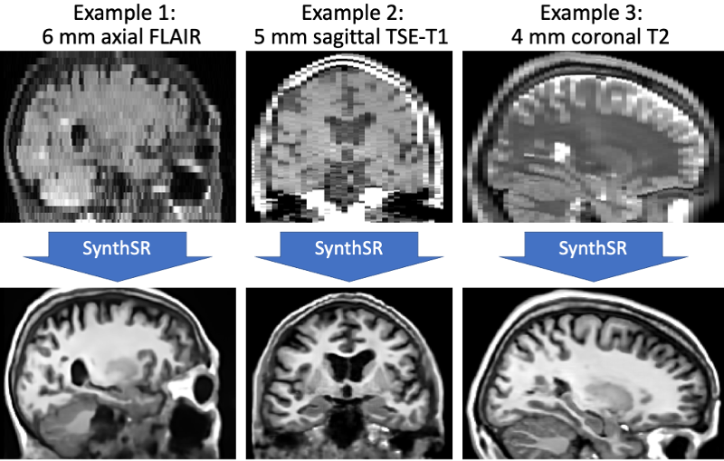
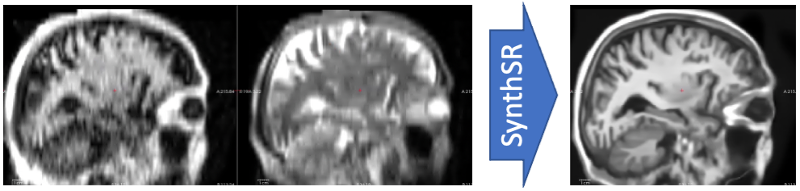
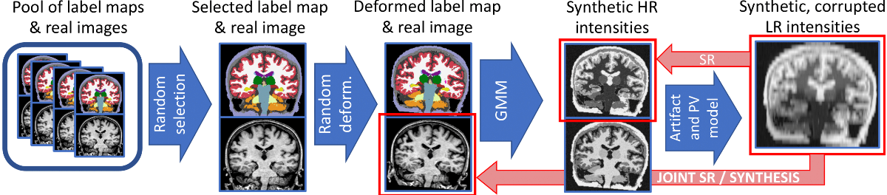
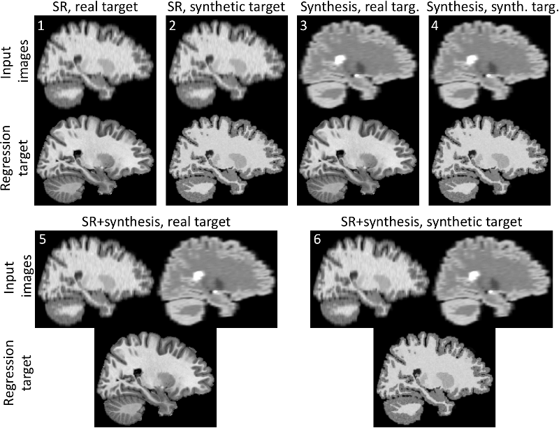

# SynthSR

This repository contains an implementation of SynthSR, a convolutional neural network that turns a clinical MRI scan 
(or even CT scan!) of any orientation, resolution and contrast into 1 mm isotropic MP-RAGE, **while inpainting lesions (which enables easier segmentation, registration, etc)**. You can then run your
favorite neuroimaging software on these synthetic images for segmentation / registration / any other analysis:

[Joint super-resolution and synthesis of 1 mm isotropic MP-RAGE volumes from clinical MRI exams with scans of different 
orientation, resolution and contrast](https://www.sciencedirect.com/science/article/pii/S1053811921004833) \
Iglesias JE, Billot B, Balbastre Y, Tabari A, Conklin J, RG Gonzalez, Alexander DC, Golland P, Edlow B, Fischl B \
NeuroImage (2021)
\
\


----------------


### "I don't know anything about Python"

Don't worry! SynthSR is now part of the development ("dev") version of [FreeSurfer](https://surfer.nmr.mgh.harvard.edu/fswiki). 
You can download the dev version [HERE](https://surfer.nmr.mgh.harvard.edu/pub/dist/freesurfer/dev/).
Instructions on how to use SynthSR once FreeSurfer has been installed can be found [HERE](https://surfer.nmr.mgh.harvard.edu/fswiki/SynthSR).


### I know a bit about Python: easy use of SynthSR with one command

We provide an "all purpose" model that can be applied to a scan of any resolution of contrast.
Once all the python packages are installed (see below), you can simply test SynthSR on your own data with:
```
python ./scripts/predict_command_line.py <input> <output> [--cpu] [--threads N] [--ct]
```
where:
- `<input>` is the path to an image to super-resolve / synthesize. \
This can also be a folder, in which case all the image inside that folder will be processed.
- `<output>` is the path where the synthetic 1 mm MP-RAGE will be saved. \
This must be a folder if `<input>` designates a folder.
- `<--cpu>` (optional) run on the CPU rather than the GPU.
- `<--threads N>` (optional) number of threads to use when using CPU. The default is just 1, 
so crank it up for faster processing if you are using the CPU version and have multiple cores!
- `<--ct>` (optional) Use this flag when processing CT scans (details below).

The synthetic 1mm MP-RAGE will be of a standard contrast, bias field corrected, and with white matter lesions inpainted.

We note that the robustness against MR contrast / orientation /resolution was not presented in the original SynthSR
paper, so if you use this model, please cite:

[SynthSeg: Domain Randomisation for Segmentation of Brain MRI Scans of any Contrast and Resolution](https://arxiv.org/abs/2107.09559) \
Billot B, Greve DN, Puonti O, Thielscher A, Van Leemput K, Fischl B, Dalca AV, Iglesias JE \
Under review (preprint on ArXiv)

Regarding CT scans: SynthSR does a decent job with CT them! The only caveat is that the dynamic range of CT is very 
different to that of MRI, so they need to be clipped to [0, 80] Hounsfield units. You can use the --ct flag to do this,
as long as your image volume is in Hounsfield units. If not, you will have to clip to the Hounsfield equivalent yourself
(and not use --ct).


### Processing Hyperfine scans

We also provide a dedicated, multispectral (T1+T2) model for Hyperfine scans. While you can apply the all-purpose model
above to the T1 or T2 scans from Hyperfine, their relatively low in-plane resolution (1.5mm) and particularly high noise often
degrades the results (especially when processing the T1). Beter results can be obtained by using both the T1 (FSE) and
T2 (FSE) scans as input to a separate, dedicated version of SynthSR:
```
python ./scripts/predict_command_line_hyperfine.py <input_t1> <input_t2> <output> [--cpu] [--threads N]]
```
where, as in the previous version, `<input_t1>`, `<input_t2>` and `<output>` can be single files or directories.



We emphasize that:
- This version is for the "standard" Hyperfine T1 and T2 acquisitions (FSE sequence) at 1.5x1.5x5mm axial resolution.
- If there is motion between the T1 and T2 scans, the T2 needs to be pre-registered to the space of the T1, but without 
resamling to the 1.5x1.5x5mm space of the T1, which would introduce large resampling artifacts. This can be done with 
the headers; below are examples of how to achieve this with two popular packages: FreeSurfer and NiftyReg.

FreeSurfer
```
mri_robust_register --mov T2.nii.gz --dst T1.nii.gz --mapmovhdr T2.reg.nii.gz --cost NMI --noinit --nomulti --lta /dev/null
 ```
NiftyReg
```
reg_aladin -ref T1.nii.gz -flo T2.nii.gz -aff T2_to_T1.aff -rigOnly -nac -ln 1 -res /tmp/trash.nii.gz
reg_transform -updSform T2.nii.gz T2_to_T1.aff T2.reg.nii.gz
```

Also, we note that this Hyperfine super-resolution model is trained with synthetic images with no pathology; while it
may be able to cope with small lesions, it will likely fail in eg stroke. We are looking forward to other 
super-resolution approaches (possibly supervised with real images) that do a better job!


### Advanced use: training your own models

This repository contains code to train a Convolutional Neural Network (CNN) for Super-resolution (SR), or joint SR and 
data synthesis. The method can also be configured to achieve denoising and bias field correction. 

The network takes synthetic scans generated on the fly as inputs, and can be trained to regress either real or synthetic
target scans. The synthetic scans are obtained by sampling a generative model building on the 
**[SynthSeg](https://github.com/BBillot/SynthSeg)** [1] package, which we really encourage you to have a look at!


\
In short, synthetic scans are generated at each mini-batch by: 1) randomly selecting a label map among of pool of 
training segmentations, 2) spatially deforming it in 3D, 3) sampling a Gaussian Mixture Model (GMM) conditioned on the 
deformed label map (see Figure 1 below), and 4) corrupting with a random bias field. This gives us a synthetic scan at 
high resolution (HR). We then simulate thick slice spacing by blurring and downsampling it to low resolution (LR). 
In SR, we then train a network to learn the mapping between LR data (possibly multimodal, hence the joint synthesis) and
HR synthetic scans. Moreover If real images are available along with the training label maps, we can learn to regress
the real images instead.

\

Figure 1: overview of SynthSR


----------------

### Tutorials for Generation and Training


This repository contains code to train your own network for SR or joint SR and synthesis. Because the training function
has a lot of options, we provide here some tutorials to familiarise yourself with the different
training/generation parameters. We emphasise that we provide example training data along with these scripts: 5 
preprocessed publicly available T1 scans at 1mm isotropic resolution [2] with corresponding label maps obtained with 
FreeSurfer [3]. The tutorials can be found in [scripts](scripts/tutorials), and they include:

- Six generation scripts corresponding to different use cases (see Figure 2 below). We recommend to go through them all, 
(even if you're only interested in case 1), since we successively introduce different functionalities as we go through.

- One training script, explaining the main training parameters.

- One script explaining how to estimate the parameters governing the GMM, in case you wish to train a model on your own 
data.

\

Figure 2: Examples generated by running the tutorials on the provided data [2]. For each use case, we show the synhtetic 
images used as inputs to the network, as well as the regression target.

----------------

### Content

- [SynthSR](SynthSR): this is the main folder containing the generative model and training function:

  - [labels_to_image_model.py](SynthSR/labels_to_image_model.py): builds the generative model.
  
  - [brain_generator.py](SynthSR/brain_generator.py): contains the class `BrainGenerator`, which is a wrapper around 
  the model. New images can simply be generated by instantiating an object of this class, and calling the 
  method `generate_image()`.
  
  - [model_inputs.py](SynthSR/model_inputs.py): prepares the inputs of the generative model.
  
  - [training.py](SynthSR/training.py): contains the function to train the network. All training 
  parameters are explained there.
  
  - [metrics_model.py](SynthSR/metrics_model.py): contains a Keras model that implements diffrent loss functions.
  
  - [estimate_priors.py](SynthSR/estimate_priors.py): contains functions to estimate the prior distributions of the GMM
  parameters.
 
- [data](data): this folder contains the data for the tutorials (T1 scans [2], corresponding FreeSurfer segmentations 
and some other useful files)
 
- [script](scripts): additionally to the tutorials, we also provide a script to launch trainings from the terminal

- [ext](ext): contains external packages.

----------------

### Requirements
 
This code relies on several external packages (already included in `\ext`):

- [lab2im](https://github.com/BBillot/lab2im): contains functions for data augmentation, and a simple version of 
 the generative model, on which we build to build `label_to_image_model` [1]
 
- [neuron](https://github.com/adalca/neuron): contains functions for deforming, and resizing tensors, as well as 
functions to build the segmentation network [4,5].

- [pytool-lib](https://github.com/adalca/pytools-lib): library required by the *neuron* package.

All the other requirements are listed in requirements.txt. We list here the most important dependencies:

- tensorflow-gpu 2.0
- tensorflow_probability 0.8
- keras > 2.0
- cuda 10.0 (required by tensorflow)
- cudnn 7.0
- nibabel
- numpy, scipy, sklearn, tqdm, pillow, matplotlib, ipython, ...


----------------

### Citation/Contact

This code is under [Apache 2.0](LICENSE.txt) licensing. \
If you use it in a publication, please cite one of the following papers (depending on the model you use):

**Joint super-resolution and synthesis of 1 mm isotropic MP-RAGE volumes from clinical MRI exams with scans of different 
orientation, resolution and contrast** \
Iglesias JE, Billot B, Balbastre Y, Tabari A, Conklin J, RG Gonzalez, Alexander DC, Golland P, Edlow B, Fischl B \
NeuroImage (2021) \
[[link](https://www.sciencedirect.com/science/article/pii/S1053811921004833) | [bibtex](bibtex.bib)]


**SynthSeg: Domain Randomisation for Segmentation of Brain MRI Scans of any Contrast and Resolution** \
B. Billot, D.N. Greve, O. Puonti, A. Thielscher, K. Van Leemput, B. Fischl, A.V. Dalca, J.E. Iglesias \
[[arxiv](https://arxiv.org/abs/2107.09559) | [bibtex](bibtex.bib)]

This repository contains the code related to a submission that is still under review.

If you have any question regarding the usage of this code, or any suggestions to improve it you can contact us at: \
e.iglesias@ucl.ac.uk


----------------

### References

[1] *[A Learning Strategy for Contrast-agnostic MRI Segmentation](http://proceedings.mlr.press/v121/billot20a.html)* \
Benjamin Billot, Douglas N. Greve, Koen Van Leemput, Bruce Fischl, Juan Eugenio Iglesias*, Adrian V. Dalca* \
*contributed equally \
MIDL 2020

[2] *[A novel in vivo atlas of human hippocampal subfields usinghigh-resolution 3 T magnetic resonance imaging](https://www.sciencedirect.com/science/article/abs/pii/S1053811913001237)* \
J. Winterburn, J. Pruessner, S. Chavez, M. Schira, N. Lobaugh, A. Voineskos, M. Chakravarty \
NeuroImage (2013)

[3] *[FreeSurfer](https://www.sciencedirect.com/science/article/abs/pii/S1053811912000389?via%3Dihub)* \
Bruce Fischl \
NeuroImage (2012)

[4] *[Anatomical Priors in Convolutional Networks for Unsupervised Biomedical Segmentation](http://www.mit.edu/~adalca/files/papers/cvpr2018_priors.pdf)* \
Adrian V. Dalca, John Guttag, Mert R. Sabuncu \
CVPR 2018

[5] *[Unsupervised Data Imputation via Variational Inference of Deep Subspaces](https://arxiv.org/abs/1903.03503)* \
Adrian V. Dalca, John Guttag, Mert R. Sabuncu \
Arxiv preprint (2019)
